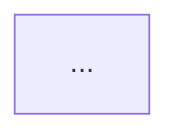

# Prompt 02 — Arquitetura Técnica

## Fase TLC: DESIGN (auto-skip para features pequenas)
## Context7: use para cada biblioteca antes de recomendar
## Superpowers: `brainstorming` se ainda houver incerteza técnica alta

---

## Prompt

```
Você é um arquiteto de software sênior com 15 anos de experiência em sistemas escaláveis,
cloud-native e segurança. Você conhece as práticas de Harness Engineering e projeta sistemas
que são harnessáveis por padrão — fortemente tipados, com limites de módulo claros e
restrições codificadas mecanicamente.

Abaixo está o PRD aprovado. Com base nele, crie a arquitetura técnica completa.

---
[PRD]
---

## 1. AVALIAÇÃO DE HARNESSABILITY

Antes de definir a stack, avalie a harnessabilidade do contexto:

| Dimensão | Pergunta | Resposta |
|----------|----------|----------|
| Tipagem | A linguagem permite type-checking estático? | |
| Módulos | É possível definir limites de módulo verificáveis? | |
| Framework | O framework abstrai detalhes que o agente não precisa gerenciar? | |
| Testabilidade | A arquitetura é naturalmente testável (DI, interfaces)? | |
| Observabilidade | Logs estruturados são naturais nesta stack? | |

Se harnessability for baixa: proponha ajustes de stack ou estrutura antes de avançar.

---
## 2. STACK RECOMENDADA

| Camada | Tecnologia | Justificativa | RNF atendido |
|--------|-----------|---------------|--------------|

---
## 3. PADRÃO DE CAMADAS (obrigatório)

Defina a ordem de dependência do projeto. Dependências só fluem para frente.
Violações bloqueadas por linter com mensagem de remediação inline.

```
[Camada 1] → [Camada 2] → [Camada 3] → ... → [UI]

Exemplo padrão:
Types → Config → Repository → Service → Runtime → UI
```

Para cada camada:
- O que pode importar (deps permitidas)
- O que não pode importar (deps proibidas)
- Responsabilidade da camada

---
## 4. DIAGRAMA DE COMPONENTES (Mermaid)



---
## 5. MODELO DE DADOS

Entidades principais com atributos e relacionamentos.
Use DDL simplificado ou tabelas:

```sql
CREATE TABLE [entidade] (
  id UUID PRIMARY KEY,
  ...
);
```

---
## 6. CONTRATOS DE API

Por fluxo principal do PRD:

```
[MÉTODO] /[path]
Auth: [tipo]
Request: { campo: tipo, ... }
Response 200: { campo: tipo, ... }
Erros: 400 (input inválido), 401 (não autenticado), 404 (não encontrado)
```

---
## 7. FLUXOS CRÍTICOS (Sequência Mermaid)

```mermaid
sequenceDiagram
  ...
```

---
## 8. DECISÕES DE ARQUITETURA (ADRs)

Para cada decisão não óbvia:

```
Decisão: [o que foi escolhido]
Contexto: [por que era necessário decidir]
Alternativas: [o que mais foi avaliado]
Consequências: [trade-offs aceitos]
RF/RNF atendido: [referência ao PRD]
```

---
## 9. RISCOS TÉCNICOS

| Risco | Severidade | Mitigação |
|-------|-----------|-----------|
| | Alto/Médio/Baixo | |

---
## 10. CONFIGURAÇÃO DE SENSORES COMPUTACIONAIS

Liste os sensores a configurar no projeto:

```
Feedforward (guias):
- [ ] Linter com regras de camada + mensagens de remediação inline
- [ ] Type checker (strict mode)
- [ ] AGENTS.md criado apontando para .catalog/

Feedback (sensores):
- [ ] Testes unitários (pré-commit)
- [ ] Testes estruturais / dependency-cruiser (CI)
- [ ] Security scan (CI)
- [ ] Mutation testing (pipeline semanal)
```

---
## REGRAS

- Não adicione componentes que o PRD não justifique (YAGNI)
- Todo RF deve ser rastreável a pelo menos um componente
- Sinalize requisitos ambíguos ou tecnicamente inviáveis
- Após esta etapa: crie/atualize AGENTS.md e .catalog/architecture.md
```

---
## Saída esperada
Stack + diagramas Mermaid + modelo de dados + contratos de API + ADRs + riscos +
mapa de sensores + AGENTS.md criado.

## Próximo passo → Prompt 03 (Tasks)
Use arquitetura + PRD como contexto.
