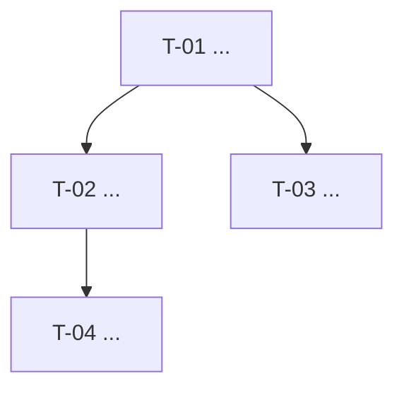
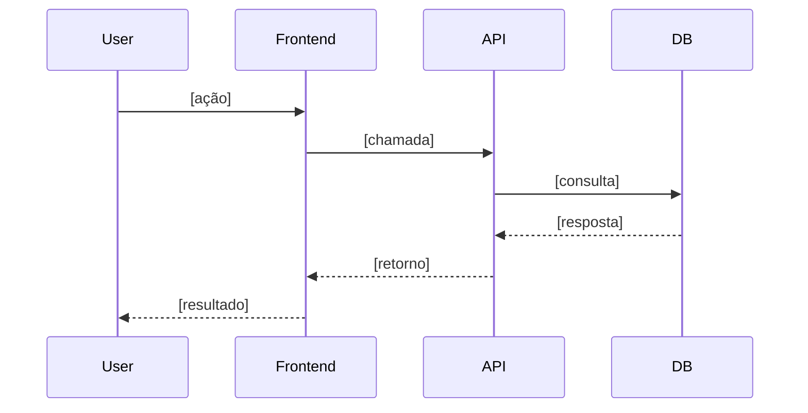

# Referência 10 — Templates de Documentação de Entregas

Modelos canônicos para os arquivos de `.milestones/`.
Use-os sempre que gerar documentação de uma nova entrega.

---

## Estrutura esperada

```
.milestones/
  [nome-do-milestone]/
    milestone.md          ← visão geral + USs + mapa de deps
    prd.md                ← requisitos de negócio (gerado na Etapa 01)
    tech-solution.md      ← solução técnica do milestone (gerado na Etapa 02)
    [US-XX-nome]/
      user-story.md       ← história + critérios de aceite
      tech-spec.md        ← spec técnica + tasks
      changelog.md        ← registro de mudanças durante a US
```

> `prd.md` e `tech-solution.md` são gerados **uma vez por milestone** (Etapas 01 e 02).
> `user-story.md`, `tech-spec.md` e `changelog.md` são gerados por US (Etapa 03), antes da Etapa 04.

---

## Template: milestone.md

```markdown
# Milestone: [Nome] — [Versão/Identificador]

Status: pending | in-progress | done
Criado: YYYY-MM-DD
PRD: .milestones/[nome]/prd.md
Solução técnica: .milestones/[nome]/tech-solution.md

---

## User Stories

- [ ] US-01: [Nome] (T-01, T-02, T-03)
- [ ] US-02: [Nome] (T-04, T-05)
- [ ] US-03: [Nome] (T-06, T-07)

## Mapa de Dependências



---

## Checklist de Release (develop → main)

- [ ] `superpowers:code-reviewer` executado e blockers/majors resolvidos
- [ ] `dotnet test` + `npm run test` passando; arch tests sem violações
- [ ] `.catalog/` e `AGENTS.md` atualizados
- [ ] PR aberto de develop → main com descrição dos CAs atendidos
- [ ] Deploy nonprd (via PR) verificado antes do merge

> **🚫 Merge de PRs é exclusivamente responsabilidade do humano — o agente nunca faz merge.**
```

---

## Template: prd.md

```markdown
# PRD: [Nome do Milestone]

**Data:** YYYY-MM-DD
**Desenvolvedor:** [perfil — ex: Solo developer (.NET C#)]
**Status:** Em elaboração | Aprovado

---

## Visão Geral

**[Nome do projeto/feature]** — descrição do problema central e por que resolver agora.

**Quem perde sem isso:** [quem é impactado e como]

---

## Escopo

### ✅ In Scope

- [item 1]
- [item 2]

### ❌ Out of Scope

- [item 1]
- [item 2]

---

## Personas

**Persona 1 — [Nome]**
- **Contexto:** [situação de uso]
- **Motivação:** [o que quer alcançar]
- **Frustrações atuais:** [dores concretas]

---

## Requisitos Funcionais

**RF-01 — [Nome]**

[Descrição em 1–2 frases.]

**Critérios de aceite:**

- [ ] CA-01.1: [critério mensurável e verificável]
- [ ] CA-01.2: [critério mensurável e verificável]

---

## Requisitos Não Funcionais

**RNF-01 — [Nome]**

[Descrição da restrição de qualidade.]

---

## Fluxo de Usuário

1. [passo 1]
2. [passo 2]
3. [passo 3]

---

## Métricas de Sucesso

| KPI | Baseline | Meta |
|-----|----------|------|
| [métrica] | [valor atual] | [valor alvo] |

---

## Riscos e Dependências

### Riscos

| ID | Risco | Severidade | Mitigação |
|----|-------|-----------|-----------|
| R-01 | [descrição] | Alto/Médio/Baixo | [ação] |

### Dependências

| ID | Dependência | Tipo | Impacto |
|----|------------|------|---------|
| D-01 | [dependência] | Externo/Interno | [impacto] |

---

## Anexos / Decisões Adiadas

- [decisão adiada e motivo]
```

---

## Template: tech-solution.md

```markdown
# Solução Técnica: [Nome do Milestone]

**Data:** YYYY-MM-DD
**Status:** Em elaboração | Aprovada

## Contexto

Breve descrição do problema técnico e de negócio que essa entrega resolve.

## Solução

Descrição da abordagem escolhida.

### Fluxo principal



### Decisões técnicas

| Decisão | Alternativas consideradas | Motivo da escolha |
|---------|--------------------------|-------------------|
| [decisão] | [alternativas] | [razão] |

## Modelo de dados

[tabelas SQL ou diagrama das entidades principais]

## Contratos de API

[endpoints principais com método, path, response e erros]

## Impactos

- Quais partes do sistema são afetadas?
- Há breaking changes?
- O que no `.catalog/` precisa ser atualizado após essa entrega?

## Fora do escopo

O que foi explicitamente deixado de fora e por quê.

## Referências

- `../prd.md`
- `.catalog/architecture.md`
```

---

## Template: user-story.md

```markdown
# [US-XX] — [Título da User Story]

**Milestone:** [nome do milestone]
**Status:** ⏳ Pendente | 🔄 Em andamento | ✅ Concluída

## História

Como [persona],
quero [ação/funcionalidade],
para que [benefício/objetivo].

## Critérios de Aceite

- **CA-01:** [descrição mensurável e verificável]
- **CA-02:** [descrição mensurável e verificável]

## Fora do escopo

O que explicitamente não será coberto por essa US.

## Referências

- Milestone: `../milestone.md`
- Spec técnica: `./tech-spec.md`
```

---

## Template: tech-spec.md

```markdown
# Spec Técnica — [US-XX] [Título da User Story]

**Milestone:** [nome do milestone]
**Status:** ⏳ Pendente | 🔄 Em andamento | ✅ Concluída

## Contexto

Breve descrição técnica do que precisa ser construído para atender essa US.
Referencie a user story e qualquer decisão de arquitetura relevante.

## Solução

### Fluxo

[passos numerados ou diagrama mermaid]

### Decisões técnicas

| Decisão | Alternativas consideradas | Motivo da escolha |
|---------|--------------------------|-------------------|
| | | |

## Tarefas

### T-XX — [Nome da Tarefa]

**Descrição:** O que deve ser implementado.
**Critérios de aceite relacionados:** CA-01, CA-02
**Detalhes técnicos:**
- [ponto técnico relevante]
- [ponto técnico relevante]

---

### T-XX — [Nome da Tarefa]

**Descrição:** O que deve ser implementado.
**Critérios de aceite relacionados:** CA-03
**Detalhes técnicos:**
- [ponto técnico relevante]

---

## Impactos

- Partes do sistema afetadas
- Breaking changes?
- O que no `.catalog/` precisa ser atualizado após essa US?

## Referências

- User story: `./user-story.md`
- `.catalog/[arquivo-relevante].md`
```

---

## Template: changelog.md

```markdown
# Changelog — [US-XX] - [Nome da User Story]

## YYYY-MM-DD — Início da entrega
Entrega iniciada com base em `user-story.md` e `tech-spec.md`.

---

## YYYY-MM-DD — [Título curto da mudança]
**O que mudou:** Descrição objetiva da mudança.
**Por quê:** Motivação — o que foi descoberto ou decidido que levou à mudança.
**Impacto:** O que foi afetado (spec, arquitetura, escopo).

---

## YYYY-MM-DD — Entrega concluída
**O que mudou:** [resumo do que foi entregue]
**Por quê:** US implementada conforme critérios de aceite.
**Impacto:** [o que habilitou no projeto]
```
