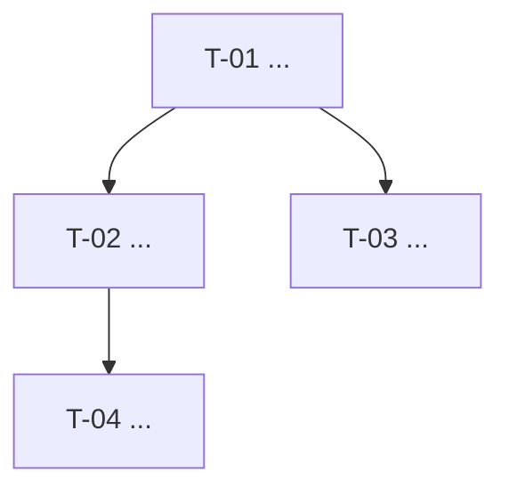

# Referência 10 — Templates de Documentação de Entregas

Modelos canônicos para arquivos de entrega quando `project_tracking.mode: local-markdown` ou quando um modo GitHub precisa de fallback markdown.

> **Hierarquia configurável:** Os templates usam `epic > user-story > task` como padrão.
> Substitua pelo que estiver em `harness.config.yaml` (`hierarchy.level1/2/3`).
> O caminho da pasta é `delivery_docs.path` (padrão: `.milestone/`).
> Milestone versionada não é obrigatória; ela só é padrão quando o projeto usa `project_tracking.mode: github-legacy` e escolhe milestones como versões planejadas.

---

## Estrutura esperada para `local-markdown`

```
[delivery_docs.path]/           ← padrão: .milestone/
  [level1-nome]/                ← padrão: epic-nome/
    [level1].md                 ← visão geral + level2s + mapa de deps
    prd.md                      ← requisitos de negócio (gerado na Etapa 01)
    tech-solution.md            ← solução técnica do level1 (gerado na Etapa 02)
    [level2-XX-nome]/
      user-story.md             ← história + critérios de aceite
      tech-spec.md              ← spec técnica + tasks
      changelog.md              ← registro de mudanças durante a entrega
```

> `prd.md` e `tech-solution.md` são gerados **uma vez por [level1]** (Etapas 01 e 02).
> `user-story.md`, `tech-spec.md` e `changelog.md` são gerados por [level2] (Etapa 03), antes da Etapa 04.

---

## Template: [level1].md

```markdown
# [Level1]: [Nome] — [Identificador opcional]

Status: pending | in-progress | done
Criado: YYYY-MM-DD
PRD: [delivery_docs.path]/[level1-nome]/prd.md
Solução técnica: [delivery_docs.path]/[level1-nome]/tech-solution.md

---

## [level2]s

- [ ] US-01: [Nome] (T-01, T-02, T-03)
- [ ] US-02: [Nome] (T-04, T-05)
- [ ] US-03: [Nome] (T-06, T-07)

## Mapa de Dependências



---

## Checklist de entrega

- [ ] Revisão executada e blockers resolvidos
- [ ] Testes/lint/build relevantes passando
- [ ] `.catalog/` e `AGENTS.md` atualizados quando aplicável
- [ ] PR aberto com descrição dos CAs atendidos, quando houver GitHub

> Merge de PRs é exclusivamente responsabilidade do humano — o agente nunca faz merge.
```

---

## Template: prd.md

```markdown
# PRD: [Nome do agrupamento]

**Data:** YYYY-MM-DD
**Desenvolvedor:** [perfil — ex: Solo developer (.NET C#)]
**Status:** Em elaboração | Aprovado

## Visão Geral

**[Nome do projeto/feature]** — descrição do problema central e por que resolver agora.

**Quem perde sem isso:** [quem é impactado e como]

## Escopo

### In Scope

- [item 1]
- [item 2]

### Out of Scope

- [item 1]
- [item 2]

## Requisitos Funcionais

**RF-01 — [Nome]**

[Descrição em 1–2 frases.]

**Critérios de aceite:**

- [ ] CA-01.1: [critério mensurável e verificável]
- [ ] CA-01.2: [critério mensurável e verificável]

## Requisitos Não Funcionais

**RNF-01 — [Nome]**

[Descrição da restrição de qualidade.]

## Riscos e Dependências

| ID | Risco/Dependência | Severidade | Mitigação |
|----|-------------------|------------|-----------|
| R-01 | [descrição] | Alto/Médio/Baixo | [ação] |
```

---

## Template: tech-solution.md

```markdown
# Solução Técnica: [Nome do agrupamento]

**Data:** YYYY-MM-DD
**Status:** Em elaboração | Aprovada

## Contexto

Breve descrição do problema técnico e de negócio que essa entrega resolve.

## Solução

Descrição da abordagem escolhida.

## Decisões técnicas

| Decisão | Alternativas consideradas | Motivo da escolha |
|---------|--------------------------|-------------------|
| [decisão] | [alternativas] | [razão] |

## Impactos

- Partes do sistema afetadas
- Há breaking changes?
- O que no `.catalog/` precisa ser atualizado após essa entrega?

## Fora do escopo

O que foi explicitamente deixado de fora e por quê.
```

---

## Template: user-story.md

```markdown
# [US-XX] — [Título da User Story]

**Agrupamento:** [nome do level1]
**Status:** Pendente | Em andamento | Concluída

## História

Como [persona],
quero [ação/funcionalidade],
para que [benefício/objetivo].

## Critérios de Aceite

- **CA-01:** [descrição mensurável e verificável]
- **CA-02:** [descrição mensurável e verificável]

## Fora do escopo

O que explicitamente não será coberto por essa US.

## Referências

- Agrupamento: `../[level1].md`
- Spec técnica: `./tech-spec.md`
```

---

## Template: tech-spec.md

```markdown
# Spec Técnica — [US-XX] [Título da User Story]

**Agrupamento:** [nome do level1]
**Status:** Pendente | Em andamento | Concluída

## Contexto

Breve descrição técnica do que precisa ser construído para atender essa US.

## Solução

[passos numerados ou diagrama mermaid]

## Tarefas

### T-XX — [Nome da Tarefa]

**Descrição:** O que deve ser implementado.
**Critérios de aceite relacionados:** CA-01, CA-02
**Detalhes técnicos:**
- [ponto técnico relevante]
- [ponto técnico relevante]

## Impactos

- Partes do sistema afetadas
- Breaking changes?
- O que no `.catalog/` precisa ser atualizado após essa US?
```

---

## Template: changelog.md

```markdown
# Changelog — [US-XX] - [Nome da User Story]

## YYYY-MM-DD — Início da entrega
Entrega iniciada com base em `user-story.md` e `tech-spec.md`.

## YYYY-MM-DD — [Título curto da mudança]
**O que mudou:** Descrição objetiva da mudança.
**Por quê:** Motivação — o que foi descoberto ou decidido que levou à mudança.
**Impacto:** O que foi afetado (spec, arquitetura, escopo).

## YYYY-MM-DD — Entrega concluída
**O que mudou:** [resumo do que foi entregue]
**Por quê:** US implementada conforme critérios de aceite.
**Impacto:** [o que habilitou no projeto]
```
