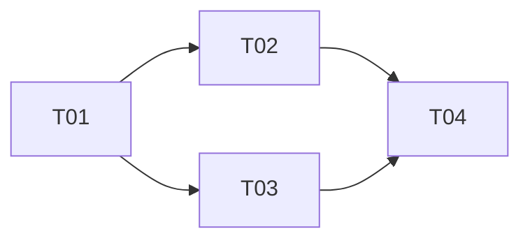
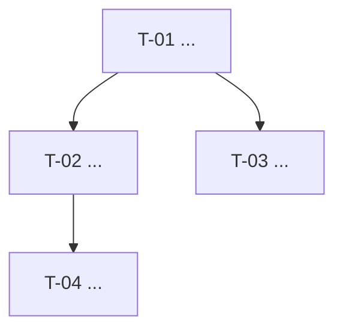

# Prompt 03 — Breakdown de Tasks

> **Skills Superpowers ([github.com/obra/superpowers](https://github.com/obra/superpowers), opcionais)**
> Skills especializadas instaláveis em `~/.claude/skills/` (Claude Code) ou `~/.agents/skills/` (demais agentes).
> - `writing-plans` — persiste o breakdown no tracking configurado com formato rastreável e links de dependência
> - `dispatching-parallel-agents` — identifica tasks independentes e as despacha em paralelo para ganho de velocidade
> Sem elas, salve o breakdown conforme `project_tracking.tool` e execute tasks sequencialmente.

> **Integração com `tlc-spec-driven` (Tech Leads Club, opcional)**
> A skill [`tlc-spec-driven`](https://agent-skills.techleads.club) organiza o desenvolvimento em três fases: **SPECIFY → DESIGN → EXECUTE**.
> Esta etapa corresponde à transição **DESIGN → EXECUTE** (breakdown de tasks).
> Auto-skip recomendado para 1–2 tasks óbvias: vá direto para `harness-implementation`.
> Sem a skill instalada, use o prompt abaixo e persista o resultado conforme `project_tracking.tool`.

---

## Prompt

```
Você é um tech lead sênior especialista em planejamento ágil e decomposição de trabalho técnico.

Abaixo estão o PRD e a Arquitetura aprovados. Com base neles, crie o breakdown completo.

---
[PRD]
---
[ARQUITETURA TÉCNICA]
---

## 1. USER STORIES

```
ID: US-[N]
Requisito PRD: RF-[N]

Como [persona], quero [ação], para que [benefício].

CA-01: [critério mensurável e verificável]
CA-02: [critério mensurável e verificável]

Estimativa: P / M / G / XG
Dependências: US-XX ou "nenhuma"
```

---
## 2. TASKS TÉCNICAS POR STORY

```
T-[N] | US-[N] | [Descrição da task]
Where:     [arquivo/módulo a criar ou alterar — camada da arquitetura]
Done when: [condição objetiva de conclusão]
Gate:      [comando verificável: npm test / curl / npx dep-cruiser / etc.]
Depends:   [T-XX ou nenhuma]
Reuses:    [componente existente ou nada]
Parallel:  [sim/não — se sim, pode rodar com dispatching-parallel-agents]
```

---
## 4. MAPA DE DEPENDÊNCIAS

Represente as dependências entre tasks:



**Regra de branch derivada do mapa de dependências:**

Cada task = uma branch `feature/T-XX-descricao`. A base da branch segue o mapa acima:

| Situação | Base da branch | PR aponta para |
|---|---|---|
| T-XX sem dependência | `develop` (ou `main`) | `develop` |
| T-XX com `Depends: T-YY` | `feature/T-YY` | `feature/T-YY` |
| T-YY foi mesclada em develop | `develop` (rebase) | `develop` |

**Comandos git por caso:**

```bash
# T-XX sem dependência
git checkout develop
git checkout -b feature/T-XX-descricao

# T-XX depende de T-YY (T-YY ainda não foi mesclada)
git checkout feature/T-YY
git checkout -b feature/T-XX-descricao

# T-YY foi mesclada; rebase de T-XX antes do PR final
git checkout feature/T-XX-descricao
git rebase develop
```

> **Atenção para tasks paralelas:** tasks marcadas `Parallel: sim` que não têm dependência entre si partem da mesma base (`develop`). Use `using-git-worktrees` do Superpowers para trabalhar nelas simultaneamente sem conflito de working tree.

**Worktrees para agents:** quando múltiplos agents ou subagentes executam tasks em paralelo, cada agent deve operar em um worktree separado para evitar conflitos de estado no working tree. Isso vale tanto para tasks independentes quanto para tasks encadeadas onde o agent da dependência ainda não concluiu:

```bash
# Criar worktree para cada task paralela
git worktree add ../projeto-T-04 feature/T-04-descricao
git worktree add ../projeto-T-05 feature/T-05-descricao

# Agent 1 opera em ../projeto-T-04
# Agent 2 opera em ../projeto-T-05 — sem conflito de working tree

# Limpar após merge
git worktree remove ../projeto-T-04
git worktree remove ../projeto-T-05
```

Use `using-git-worktrees` do Superpowers para o fluxo detalhado de setup.

---
## 5. ROADMAP DE EXECUÇÃO

Agrupe tasks por sprint respeitando dependências.
Marque tasks paralelas explicitamente:

```
Sprint 1 (fundação):
  Sequencial: T-01, T-02, T-03

Sprint 2 (core):
  Paralelo: T-04 ∥ T-05 ∥ T-06  ← usar dispatching-parallel-agents
  Após paralelo: T-07

Sprint 3 (entrega):
  Sequencial: T-08, T-09

Sprint 4 (polish):
  T-10 (review, testes, docs)
```

---
## 6. TRACKING DE ENTREGA

Persista o breakdown conforme `project_tracking.tool`:

- `github`: GitHub Issues/Projects/Milestone conforme `project_tracking.github.milestone_policy`.
- `jira`: Epic → Story → Sub-tasks no board configurado.
- `linear`: Project/Cycle → Issues → Sub-issues/checklists.
- `azuredevops`: Epic → User Story → Tasks.
- `local`: arquivos markdown em `[delivery_docs.path]/`.

Não troque a ferramenta de tracking por causa da estratégia de release. Se `release_management.strategy: github-auto-release`, a label `release:*` fica no PR GitHub, mas Jira/Linear/Azure DevOps podem continuar sendo a fonte de trabalho.

## 7. ARQUIVO DE LEVEL1 (somente `project_tracking.tool: local` ou fallback markdown)

> **Nota:** `prd.md` e `tech-solution.md` já foram gerados nas Etapas 01 e 02 respectivamente.
> Esta seção cria apenas o `[level1].md` (visão geral + USs + mapa de deps) e os arquivos por US.
> Não regere `prd.md` nem `tech-solution.md` nesta etapa — apenas referencie-os no arquivo de level1.

Gere o arquivo de level1 antes de iniciar qualquer implementação:

```markdown
# [Level1]: [Nome] — [Identificador opcional]

Status: in-progress
Criado: [YYYY-MM-DD]
Branch: `feature/[nome]` → `develop`
PRD: [delivery_docs.path]/[nome]/prd.md
Tech Solution: [delivery_docs.path]/[nome]/tech-solution.md

---

## User Stories

- [ ] US-01: [Nome] (T-01, T-02, T-03)
- [ ] US-02: [Nome] (T-04, T-05)
- [ ] US-03: [Nome] (T-06, T-07)

## Mapa de Dependências


```

---
## 8. ARQUIVOS DE USER STORY (somente `project_tracking.tool: local` ou fallback markdown)

Crie um diretório `[delivery_docs.path]/[nome]/[US-XX-nome]/` por US e gere os três arquivos abaixo.

### user-story.md

```markdown
# [US-01] — [Título da User Story]

**Agrupamento:** [nome do level1]
**Status:** ⏳ Pendente

## História

Como [persona],
quero [ação/funcionalidade],
para que [benefício/objetivo].

## Critérios de Aceite

- **CA-01:** [descrição]
- **CA-02:** [descrição]

## Fora do escopo
O que explicitamente não será coberto por essa US.

## Referências
- Agrupamento: `../[level1].md`
- Spec técnica: `./tech-spec.md`
```

### tech-spec.md

```markdown
# Spec Técnica — [US-01] [Título]

**Agrupamento:** [nome do level1]
**Status:** ⏳ Pendente

## Contexto
Breve descrição técnica do que precisa ser construído para atender essa US.

## Solução

### Fluxo
[passos ou diagrama mermaid]

### Decisões técnicas

| Decisão | Alternativas consideradas | Motivo da escolha |
|---------|--------------------------|-------------------|
| | | |

## Tarefas

### T-01 — [Nome da Tarefa]
**Descrição:** O que deve ser implementado.
**Critérios de aceite relacionados:** CA-01, CA-02
**Where:** [arquivo/módulo]
**Done when:** [condição objetiva]
**Gate:** [comando verificável]

---

### T-02 — [Nome da Tarefa]
**Descrição:** O que deve ser implementado.
**Critérios de aceite relacionados:** CA-03
**Where:** [arquivo/módulo]
**Done when:** [condição objetiva]
**Gate:** [comando verificável]

---

## Impactos
- Partes do sistema afetadas
- Breaking changes?
- O que no `.catalog/` precisa ser atualizado após essa US?

## Referências
- User story: `./user-story.md`
- `.catalog/[arquivo-relevante].md`
```

### changelog.md

```markdown
# Changelog — US-01 - [Nome da User Story]

## [YYYY-MM-DD] — Início da entrega
Entrega iniciada com base em `user-story.md` e `tech-spec.md`.
```

---
## 9. PERSISTÊNCIA NO GITHUB (somente `project_tracking.tool: github`)

**Não use `[delivery_docs.path]/` como repositório principal de tasks quando GitHub está conectado — use GitHub Issues.**

Após gerar o breakdown, crie:

1. **GitHub Milestone ou Project field**:
   - Use Milestone quando `project_tracking.github.milestone_policy` for `thematic` ou `versioned`
   - Use nome versionado apenas quando `milestone_policy: versioned` ou `release_management.strategy: github-legacy`

2. **Issue de Tech Solution** (label: `documentation`, vinculada ao Milestone):
   - Body: decisões técnicas do breakdown, ADRs provisórios, riscos

3. **Uma Issue por User Story** (label: `user-story`, vinculada ao Milestone):
   - Body: story, CAs, tasks técnicas (T-XX) como checklist
   - `Closes #N` no PR que implementar a story fecha a Issue automaticamente

4. **GitHub Projects board** (se existir): adicione as Issues para visibilidade de progresso

**`.handoffs/`** → apenas para handoffs de sessão em andamento (temporário).

---
## REGRAS

- Toda task deve ter Done when objetivo — sem ambiguidade
- Toda task mapeia para um RF do PRD via sua US
- XG (>5 dias) → considere quebrar em tasks menores
- Tasks sem dependência entre si → marque Parallel: sim
- A ferramenta em `project_tracking.tool` substitui `[delivery_docs.path]/` como rastreabilidade permanente quando estiver conectada

## ESTIMATIVAS
P = horas | M = 1–2 dias | G = 3–5 dias | XG = >5 dias

---
## Saída esperada
Stories + tasks com rastreabilidade, estimativas e gates — persistidos conforme `project_tracking.tool`.

## Próximo passo → Prompt 04 (Código)
Use uma task por vez. Contexto: PRD + Arquitetura + AGENTS.md.

